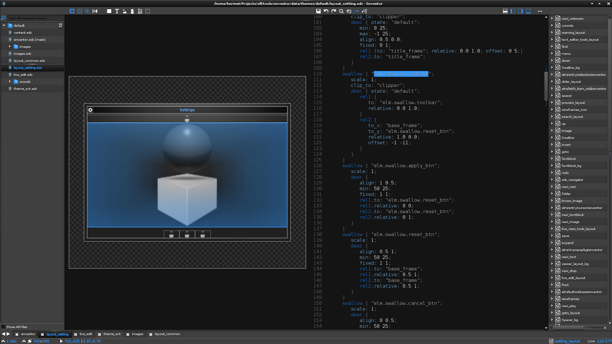

# Enventor

Enventor, which is also known as EDC (Edje Data Collections) Editor, is a EDC script editor tool that supports text editing and previewing functions for the EDC source code.

When your application requires real-time changeable layouts like animated ones, then you can write the layout design using EDC script, compile it into EDJ format file, and import it into your application using a UI layout component. You can also write design layouts from simple to complex ones using the EDC script with Enventor. Enventor helps you write EDC script code easier and finish your work faster. If you are not familiar with EDC programming, see Edje Programming Guide - https://www.enlightenment.org/program_guide/edje_pg for more information.



## Contents
- [Requirements](#requirements)
- [Compiling](#compiling)
- [Short Cut Keys](#Short-Cut-Keys)
- [Command Line Usage](#Command-Line-Usage)
- [Developers](#Developers)


## Requirements

```
  efl (>= 1.21.0)
```
Please note that some features may not quite function correctly or completely prior to EFL 1.21. Newer would be better.

Please see the following sites for more information.

https://www.enlightenment.org/about-enventor


## Compiling

Once you have met the requirements, compiling and installing is simple:
```
  $ ./autogen.sh
  
  $ make
  $ sudo make install
  $ sudo ldconfig (it may need on Linux System) 
```

## Short Cut Keys

```
Esc - Open/Close Menu
F1 - Help
F2 - Set Main EDC (in File Browser)
F3 - Quick Jump (Open an including file / Jumping to a referencing part)
F4 - Revert Quick Jump
F5 - Keyword Reference
F7 - Toggle Tools
F8 - Toggle Status
F9 - Toggle File Browser
F10 - Toggle EDC Navigator
F11 - Toggle File Tab
F12 - Settings

Ctrl+S - Quick Save + Update Live View
Ctrl+U - Toggle Dummy Parts
Ctrl+H - Toggle Part Highlighting
Ctrl+M - Toggle Mirror Mode
Ctrl+W - Toggle Wireframes
Ctrl+T - Insert Default Template Code
Ctrl+Mouse Wheel Up - View Zoom In / Font Size Up
Ctrl+Mouse Wheel Down - View Zoom Out / Font Size Down

Alt+Left - Toggle Full Edit View
Alt+Right - Toggle Full Live View
Alt+Up - Toggle Full Console View
Alt+Down - Toggle Full Editors View

Ctrl+A - Select Text All
Ctrl+Double Click - Select a word without openning candidate popup
Ctrl+Z - Undo Text
Ctrl+R - Redo Text
Ctrl+C - Copy Selected Text
Ctrl+V - Paste Copied Text
Ctrl+X - Cut Selected Text
Ctrl+D - Delete a Current line
Ctrl+F - Find/Replace
Ctrl+L - Go to line
Ctrl+Home - Go to the Top line
Ctrl+End - Go to the Bottom line
Ctrl+Space - Search candidate keywords in the context
```

## Command Line Usage

enventor --help
enventor [input file] [output file] [-t] [-i image path] [-s sound path] [-f font path] [-d data path] [-w workspace path]

input file = EDC file to open. If input file is skipped, Enventor will open a default template code with a temporary file.
output file = EDJ file to store compiled file. If output file is skipped, Enventor will store the binary file to the temporary directory.
```
-t = Open template menu when you launch Enventor
-i = path to image resources that the edc includes
-s = path to sound resources that the edc includes
-f = path to font resources that the edc includes
-d = path to data resources that the edc includes
-w = workspace directory path that contains group edc files
```

Examples of Enventor command line usage:
```
$ enventor
$ enventor input.edc -i ./images
$ enventor input.edc output.edj -i ./images
$ enventor -t
$ enventor newfile.edc -t
$ enventor input.edc output.edj -i ./images -s ./sounds -w ./workspace
```

## Developers

Many developers have contributed to Enventor project. The following names are dedicated Enventor developers' names but there are more people who've gladly contributed for Enventor. For a complete list of contributors, See AUTHORS file.

Copyright (C) 2013 - 2019 by:
```
Hermet Park
Jaehyun Cho
Mykyta Biliavskyi
Kateryna Fesyna
Tae-Hyup Kim
Bowon Ryu
Yunho Jeong
Mincheol Seo
Raoul Hecky
Yurii Tsivun
```
And various contributors (See AUTHORS)
